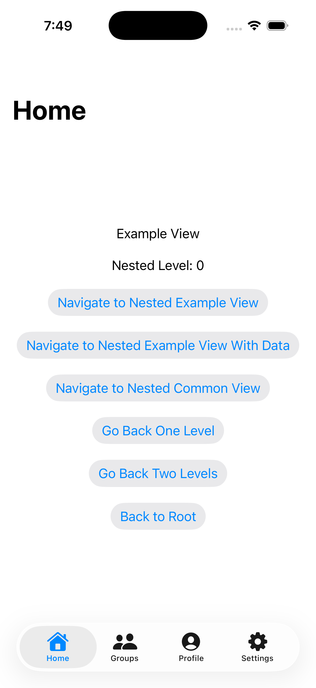
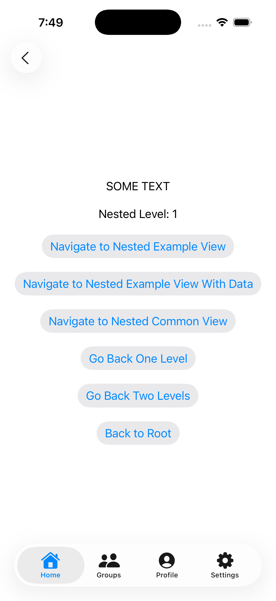
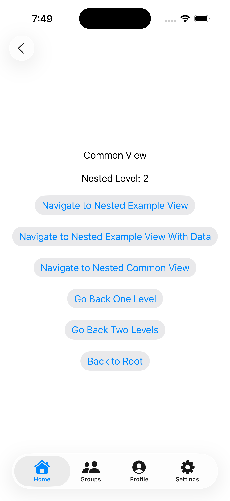

# SUI Tabs Boilerplate

A modern SwiftUI tabs + navigation boilerplate showcasing:
- Multi-tab architecture with per-tab navigation stacks
- Programmatic navigation using routers
- The new Swift Observation system (@Observable) and @Environment injection
- Clean separation between tabs, routes, and routers
- Swift 6 actor-isolation compliance

This repository is intended as a learning resource and a solid starting point for apps that need a tab bar with nested navigation flows per tab.

## Features

- Tab bar with configurable tabs (Home, Groups, Profile, Settings)
- Independent navigation stacks per tab using NavigationStack(path:)
- Type-safe routing via enums that produce SwiftUI views
- Simple dependency injection via environment for routers
- Programmatic navigation helpers (navigate, back, root)
- Previews for views and navigation flows

## Requirements

- Xcode 15.4 or newer
- Swift 5.9+ (Swift 6 ready)
- iOS 17.0+ (recommended) due to the new Observation + Environment APIs

If you need to support earlier OS versions, see the “Supporting older OS versions” section below.

## Architecture

The project is split into four main concepts:

- Tabs (Tab)
  - An enum representing each tab with icon, isEnabled, router, and root view.
  - Conforms to a TabProtocol that enforces CaseIterable and Identifiable.

- Routes (Routes, Routes.Common)
  - Enums representing navigation destinations within a tab.
  - Each case produces a SwiftUI view via view().

- Routers (Router, TabRouter)
  - Router: Manages a NavigationStack path ([Routes]) for a given tab.
  - TabRouter: Manages the active tab selection for the TabView and provides a Binding<Tab> for selection.
  - Both are @Observable and injected via the environment.

- Screens/Views
  - TabsScreen: Hosts the TabView and a NavigationStack per enabled tab.
  - ExampleView, ExampleViewWithData, CommonView: Example destinations.
  - NavigationHelperView: Buttons that demonstrate programmatic navigation.

## Key Files

- App entry
  - sui_tabs_boilerplateApp.swift: App entry point
  - ContentView.swift: Creates TabsScreen and can inject routers into the environment

- Tabs
  - Tabs.protocol.swift: TabProtocol
  - Tabs.swift: Tab enum with icon, router, root view

- Routes
  - Routes.protocol.swift: RoutesProtocol (@MainActor)
  - Routes.swift: Routes enum
  - CommonRoutes.swift: Routes.Common enum

- Routers
  - Router.swift: Per-tab router with path binding and navigation handler
  - TabRouter.swift: Active tab selection + Binding<Tab>
  - DefaultRouters.swift: Simple shared instances (replace with your DI solution)

- Example views
  - ExampleView.swift, ExampleViewWithData.swift, CommonView.swift
  - NavigationHelperView.swift: Demonstrates programmatic navigation

## Swift 6 and Actor Isolation

This project is Swift 6–ready. To satisfy Swift 6’s stricter actor isolation:

- RoutesProtocol is marked @MainActor so conformers (Routes, Routes.Common) can implement view() on the main actor without isolation violations.
- Router and TabRouter are @MainActor and @Observable; all UI-related mutations happen on the main actor.
- Binding setters that mutate main-actor state use @Sendable closures and hop back to the main actor with Task { @MainActor in … } to avoid “Converting non-Sendable function to @Sendable” errors.

## Dependency Injection

By default, this project provides a simple DefaultRouters container with shared instances. In production, you should replace this with your own DI strategy.

Recommended (iOS 18+):
- Inject @Observable models with .environment(model) at the app root.
- Access with @Environment(ModelType.self) in views.

## Examples

  
  
  

